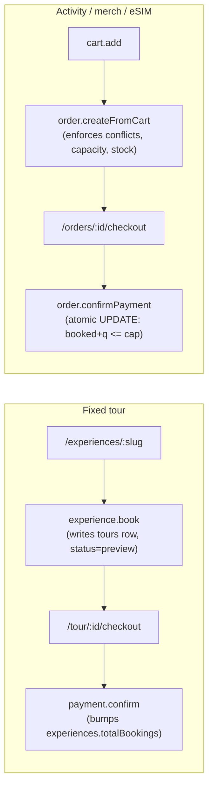

# Booking lifecycle

This document is the source of truth for how travelers book, pay, cancel,
and refund on LOCOMATE. The invariants described here are enforced by
tests in [app/src/server/routers/booking-hardening.test.ts](../src/server/routers/booking-hardening.test.ts)
and [app/src/server/routers/booking-concurrency.test.ts](../src/server/routers/booking-concurrency.test.ts);
any change to the flow that violates an invariant should break CI.

## Two paths

LOCOMATE has two booking surfaces that share the same payment table but
different pre-payment plumbing:



- `fixed_tour` is NOT a cart kind. Travelers book fixed tours directly
  via `experience.book` which writes a `tours` row and redirects to the
  tour-centric checkout. Routing a tour through the cart would need per-
  line scheduling metadata the cart doesn't carry.
- Activities, merch, eSIM, and guide add-ons go through the cart-plus-
  order flow.

## State machines

### `orders.status`

```
pending -> paid           (order.confirmPayment)
pending -> cancelled      (order.cancel [user] OR order.reapStale [cron])
paid    -> refunded       (payment.refund [admin])
```

### `payments.status`

```
pending -> succeeded      (order.confirmPayment OR payment.confirm)
pending -> cancelled      (order.cancel OR reap-orders cron)
succeeded -> refunded     (payment.refund)
```

### `activity_slots.status`

```
open -> sold_out          (order.confirmPayment flips if booked == capacity)
sold_out -> open          (payment.refund flips back)
```

### `tours.status`

```
preview              -> paid                 (payment.confirm, legacy path)
preview              -> cancelled            (not modeled; previews age out without blocking)
preview              -> customized_pending   (crossover.migrateToCustom — Fixed → Custom one-click)
customized_pending   -> paid                 (payment.confirm after the user finalises the custom plan)
paid                 -> active               (tour.start, outside booking scope)
active               -> completed            (tour.finish)
paid                 -> refunded             (payment.refund for tour-linked payment)
paid                 -> system_cancelled     (T-24h cron when crossover didn't lock; 100% refund)
```

### `tour_crossover_requests.status` (NEW — Crossover Matching, PRD §5.11)

```
pending     -> matched      (other party accepts)
pending     -> expired      (anti-overlap rule, or T-28h cron when chat window closes)
pending     -> terminated   (declined)
matched     -> locked       (both parties tap [Chốt hành trình chung]; Δ settled)
matched     -> expired      (T-28h cron: chat window timed out without a lock)
matched     -> terminated   (chat.reportCrossoverPartner)
locked      -> terminated   (T-24h cron if escrow Δ-payment failed and grace expired)
```

### `escrow_adjustments.status` (NEW)

```
pending     -> succeeded    (Stripe Payment Element confirms the Δ-charge OR auto-refund completes)
pending     -> failed       (gateway decline or 30-min grace expired)
pending     -> reverted     (peer rolls back the lock-in after a failed Δ)
no_change                   (terminal — Δ = 0, no payment needed)
```

## Pre-departure timeline (NEW — Crossover Matching, PRD §5.11)

Every Fixed Tour and Customized Tour booking now traverses four
cron-driven anchor points before departure. The anchors are computed
from `tours.start_at` (or, for `fixed_tour` bookings,
`tours.request_params.date + start_time`) in Vietnam local time. The
handlers all live under `/api/cron/crossover-*` and require
`Authorization: Bearer $CRON_SECRET` (same pattern as the order reaper).

```
                T-48h          T-36h          T-28h          T-24h           departure
                  │              │              │              │                 │
booking cutoff ──▶│              │              │              │                 │
                  │  warning +   │              │              │                 │
                  │  one-click   │              │              │                 │
                  │  migrate     │              │              │                 │
                  │              │  anonymous   │              │                 │
                  │              │  discovery   │              │                 │
                  │              │  + pushes    │              │                 │
                  │              │              │  chat window │                 │
                  │              │              │  closes;     │                 │
                  │              │              │  unlocked    │                 │
                  │              │              │  pairs       │                 │
                  │              │              │  expire      │                 │
                  │              │              │              │  auto-cancel    │
                  │              │              │              │  + 100% refund  │
                  │              │              │              │  if unlocked    │
```

| Anchor | Cron path | Cadence | Effect on `tours.status` |
|---|---|---|---|
| **T−48h** | `/api/cron/crossover-t48` | every 15 min | New bookings are blocked at this point; under-capacity bookings get the warning + migration CTA (no state change yet). |
| **T−36h** | `/api/cron/crossover-t36` | every 15 min | Opens the discovery surface; writes one row per recipient into `crossover_discovery_pushes` for dedupe. |
| **T−28h** | `/api/cron/crossover-t28` | every 15 min | Closes the 8-hour negotiation window. `tour_crossover_requests.status='matched'` rows without a `locked_at` flip to `expired`. |
| **T−24h** | `/api/cron/crossover-t24` | every 15 min | Auto-cancels any `fixed_tour` booking still under capacity OR whose crossover never `locked`. Sets `tours.status='system_cancelled'`, runs a 100% refund, releases the guide's `host_availability` slot. |

The 15-minute cadence is granular enough that a traveler buying a tour
at, say, "exactly T−48h minus 14 minutes" still gets a clean booking-cutoff
experience on the very next tick. Vercel Hobby's daily-cron limit
forced the original order-reaper to run once a day; Crossover requires
Pro-tier cron frequency.

## Concurrency invariants

The only durable authority for "last seat wins" is the conditional UPDATE
at `order.confirmPayment`:

```sql
UPDATE activity_slots
   SET booked_count = booked_count + :qty
 WHERE id = :slot_id
   AND booked_count + :qty <= capacity
RETURNING *;
```

If two travelers race to the last seat, only the winning UPDATE returns a
row; the loser gets an empty `RETURNING` and we throw
`PRECONDITION_FAILED` with "sold out before you could confirm". The same
pattern applies to `product_variants.stock_quantity`.

Pre-payment checks (`cart.add`, `order.createFromCart`) are
best-effort: they give a better UX by surfacing "sold out" early, but
the truth is enforced at confirm time.

Pending orders **DO NOT** decrement capacity. If you need a
reservation-style hold (short-TTL lock during the pending window), that's
a deliberate next-step design; MVP is confirm-or-forget.

## Anti-collision

Four kinds of collision are blocked server-side:

1. **Traveler already has a paid booking at the same time.**
   `experience.book` queries the user's paid/active/completed tours
   before inserting a new preview. `order.createFromCart` pulls the same
   pool and runs `detectConflicts` against all activity lines in the
   cart.
2. **Host is already booked.** `experience.book` filters `tours` on the
   resolved `hostId` with `status IN (paid, active, completed)` and
   overlaps the proposed window. Preview tours don't block (they
   represent no commitment -- travelers routinely abandon them).
3. **Host is trying to schedule overlapping slots.**
   `activity.addSlot` queries the host's existing `open` slots across
   every activity they own and rejects overlaps. Prevents the "I'm in
   two places at once" calendar inconsistency.
4. **Crossover Anti-Overlap (NEW).** A traveler may send `pending`
   crossover requests to multiple candidates across non-overlapping
   departures, but cannot have **two `matched` requests on the same
   calendar slot**. `crossover.sendRequest` and
   `crossover.acceptRequest` run an `enforceAntiOverlap` check in the
   same transaction as the state flip: a conflicting `matched` row
   throws `PRECONDITION_FAILED`; conflicting `pending` rows on the same
   slot are bulk-updated to `expired`. See
   [TRD §5.7 (b)](TRD.md#57-crossover-matching-engine-new--capacity-rescue)
   for the algorithm.

The shared overlap helper lives in
[app/src/lib/cart-conflicts.ts](../src/lib/cart-conflicts.ts). Both
`cart.get` (UI warning) and `order.createFromCart` (server block) call
the same function so the two layers never disagree.
`enforceAntiOverlap` shares the same overlap primitive so a single
"do these two slots overlap?" definition governs all four collision
paths.

## Host availability

`experience.book` checks `host_profiles.is_available = true` at booking
time. A host can pause bookings (e.g. going on vacation) by flipping
that flag; existing paid bookings are unaffected but no new ones are
accepted. Mirrors what `tour.assignHost` already did for algorithmic
tours.

## Refunds

There are now **four** refund triggers, each with a different actor and
state machine. PRD §FR-PAY-04 is the canonical policy table; this
section is the implementation contract.

### 1. Admin-initiated refund (`payment.refund`)

Admin-only via `adminProcedure`. Flips a succeeded payment to
`refunded` and reverses the inventory side-effects:

- `activity` lines: `activity_slots.booked_count -= qty`, `status =
  'open'` (re-opens a sold-out slot).
- `merch` lines: `product_variants.stock_quantity += qty`.
- `esim` / `guide_addon`: nothing to reverse.
- Legacy tour payments: `tours.status = refunded`, decrement the
  experience's public `totalBookings` so marketplace ranking forgets
  the sale.

Idempotent: already-refunded payments are rejected loudly so an
accidental double-submit doesn't double-restore stock.

### 2. Traveler-initiated cancel (`tour.cancelByTraveler`)

The amount refunded depends on the timing **and** on whether a
Crossover lock-in has happened:

| Condition | Refund | Mechanism |
|---|---|---|
| Cancel > 24h before departure, no crossover lock | **100%** | Full `payment.refund` |
| Cancel 2–24h before departure, no crossover lock | **50%** | `payment.refundPartial(50%)` — 50% retained as penalty for the held guide hour |
| Cancel < 2h before departure | **0%** | No refund; tour transitions `paid → cancelled` |
| Cancel **after** a crossover route is locked (the merged itinerary already exists and the partner is committed) | **50%** | `payment.refundPartial(50%)` — 50% split covers operating cost AND the matched partner's held guide hour |
| Guide cancels | **100%** | Auto-refund + rebook offer if alternative guides are available |

The 50%-after-lock branch is the meaningful new addition: it
penalises walkaway after the system already wrote a `tour_crossover_requests.status='locked'` row, because at that point the system has irreversibly
committed a guide hour AND a paired traveler's slot.

### 3. T−24h system auto-cancel (`/api/cron/crossover-t24`)

Triggered by the Crossover Matching cron when a booking is still under
capacity OR its crossover never locked OR its escrow Δ-payment failed
through the grace window. Per leg of the pair:

```
BEGIN;
  SELECT * FROM tours WHERE id = ? FOR UPDATE;
  IF tours.status IN ('paid', 'preview', 'customized_pending'):
    UPDATE tours
       SET status = 'system_cancelled',
           cancelled_at = NOW(),
           cancel_reason = 'crossover_under_capacity'
     WHERE id = ?;
    INSERT INTO payments (..., status = 'refunded', refund_amount = priceAmount)
      ON CONFLICT (tour_id) DO UPDATE
      SET status = 'refunded', refund_amount = excluded.refund_amount;
    UPDATE host_profiles
       SET is_available = true
     WHERE id = (SELECT host_id FROM tours WHERE id = ?);
  END IF;
COMMIT;
```

**100% refund every time** — the cancellation is fully on Locomate (the
business model failed to find a second traveler), and policy treats
this as zero-fault to the customer.

### 4. Crossover Escrow Adjustment (`crossover.lockRoute` → Δ-settlement)

Not a "refund" in the customer-cancellation sense, but uses the same
`payment.refundPartial` plumbing. See PRD §FR-CROSS-06 + TRD §5.7 (d).
One `escrow_adjustments` row is written per leg of the pair:

- **Δ > 0** → Stripe Payment Element pops up in-chat; on success the
  row flips `pending → succeeded` and the new payment is linked back to
  the tour.
- **Δ < 0** → server immediately calls `payment.refundPartial(|Δ|)`;
  row flips `pending → succeeded`.
- **Δ = 0** → row inserted with `status='no_change'` (terminal); audit
  only.
- **Charge declines** → row flips `pending → failed`; if no retry in
  the 30-min grace window, the lock-in is rolled back (row →
  `reverted`) and the partner is notified.

### Database invariants

CHECK constraints (`booked_count >= 0`, `stock_quantity >= 0`) are a
backstop against any refund bug that over-decrements. The Crossover
schema adds:

- `escrow_adjustments.delta_vnd` is allowed to be negative (it's the
  signed amount), but `cost_old_vnd`, `cost_new_vnd` must be `>= 0`.
- `priority_matching_vouchers.uses_remaining >= 0` — vouchers
  hard-floor at zero rather than going negative.

## Pending order TTL

A cron at `/api/cron/reap-orders` runs once a day at 03:00 UTC (10:00
Vietnam local) on Vercel Hobby -- see [vercel.json](../vercel.json).
Hobby plans are limited to daily crons; upgrading to Pro lets us drop
to every-15-minutes for faster abandoned-cart cleanup. The code doesn't
care about the frequency: `reapStaleOrders(db, 30)` just looks at the
pending-older-than-30-minutes set, so running hourly, daily, or on-demand
all work. Pending orders older than 30 minutes flip to `cancelled`
with `cancel_reason = 'payment_abandoned'`. Their linked `payments` rows
are cancelled too.

The cron endpoint requires `Authorization: Bearer $CRON_SECRET`; the
secret must be set in Vercel env vars before the cron does anything. In
preview / local dev with no secret set, the endpoint returns 503 so we
don't accidentally reap demo data.

Pending orders don't hold inventory, so the reaper is purely
janitorial: it keeps "recent activity" dashboards readable and lets us
measure cart abandonment honestly.

## Database constraints

Enforced by [app/scripts/create-booking-integrity.ts](../scripts/create-booking-integrity.ts),
mirrored in [app/src/test/setup.ts](../src/test/setup.ts):

- `activity_slots.booked_count >= 0`
- `activity_slots.booked_count <= capacity`
- `product_variants.stock_quantity >= 0`
- `order_items.product_variant_id` has a real FK to
  `product_variants.id` (was previously plain UUID with no FK --
  orphans were silently possible).

## Known limitations

- **No short-TTL hold** during the pending window. If two travelers
  check out at the same time the second one can fail at confirm; we
  surface a clear error but it's not the smoothest UX. Hold-based
  reservation with an explicit release at `order.cancel` /
  `order.reapStale` is a plausible next step.
- **No overbooking buffer.** `bookedCount + qty <= capacity` is strict.
- **No waitlist.** When a slot sells out the UI disables it; travelers
  can't opt-in to be notified of a cancellation.
- **No host blackout calendar.** Hosts flip a single `isAvailable` bit;
  fine-grained per-day availability lives in `host_availability` but
  `experience.book` doesn't consult it today.
- **Experience-booked tours don't participate in activity cart conflict
  detection with activities they SHARE a calendar day with.** They do
  participate when the tour is already `paid`; a `preview` tour the
  traveler has only half-finished booking is ignored. Edge case;
  surface a "you have an unfinished booking" CTA instead.
- **No mid-departure crossover.** A booking that's already past T−24h
  cannot be saved by a late-arriving second traveler; the system
  policy is "cancel cleanly, refund 100%" rather than build a
  same-day reservation flow. Same-day rescue would require both a
  shorter cron cadence and a separate state machine; out of scope for
  Phase 2.
- **Crossover pairs are strictly 1:1.** Two unmatched
  single-bookings on the same departure aren't auto-grouped into a
  3-person tour even when capacity allows; the chat negotiation model
  assumes 2 participants. Three-way crossover is a Phase 3 design.
- **No "match again with the same partner".** A `reportPartner` only
  bans the pair, not the relationship in the abstract. The reported
  user might re-appear in the reporter's future discovery feed,
  flagged with an internal cooldown. The full-account moderation
  queue is the slower path for repeat offenders.
