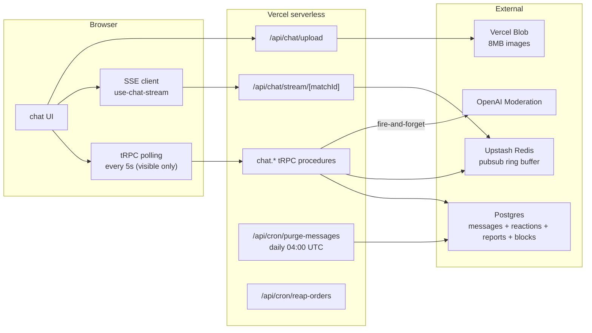

# Chat

Marketplace-grade chat between travelers and hosts. This document is the
source of truth for the feature; invariants described here are enforced
by tests in [app/src/server/routers/chat.router.test.ts](../src/server/routers/chat.router.test.ts)
and [app/src/server/routers/chat-features.test.ts](../src/server/routers/chat-features.test.ts).

## Architecture



### Transport

- **Polling** (5 s cadence, paused when the tab is hidden) is the
  truth-floor: even without real-time infra every client catches up.
- **SSE** (`/api/chat/stream/[matchId]`) is an enhancement. The server
  polls Upstash's chat ring buffer every 1.5 s and fans events out to
  connected clients. Latency user-visible: ≤ 1.5 s + one network hop.
- **No custom WebSocket server.** Vercel serverless can't hold
  persistent connections cheaply, and marketplace chat doesn't need
  Slack-grade concurrency.

When Upstash credentials aren't configured, SSE connects but only
emits heartbeats; the client polling continues to refresh data.
Everything degrades gracefully.

## Data model

See [schema.ts](../src/server/db/schema.ts). Key tables:

| Table | Role |
| --- | --- |
| `matches` | Pair-key between two users. `user_a_id` / `user_b_id` are **nullable** with `ON DELETE SET NULL` so an account deletion doesn't wipe the survivor's conversation. |
| `messages` | The thread content. Columns: `edited_at`, `deleted_at`, `deleted_reason`, `attachment_url`, `attachment_kind`, `flagged`, `flag_reason`. Soft-delete is used for unsend + account-deletion tombstones; hard-delete happens at retention. |
| `message_reactions` | Emoji reactions. UNIQUE `(message_id, user_id, emoji)` so double-click is a no-op. |
| `message_reports` | Trust-and-safety queue rows. |
| `user_blocks` | Mutual block list. Symmetric filter applied in chat + browse. |

Index on `messages(created_at)` backs the daily retention cron.

## State machines

### `messages.deleted_at` / `deleted_reason`

```
NULL                                              -> intact, default
set by user via chat.deleteMessage                -> 'user_unsent' (24h window)
set by user.deleteAccount                         -> 'sender_account_deleted'
row hard-deleted                                  -> 30-day retention cron
```

### `messages.flagged`

```
false                                             default
true + flag_reason='contact_info'                 applyContactInfoMask scrubbed PII
true + flag_reason='harassment'/'spam'/...        chat.reportMessage was called
true + flag_reason='violence'/'sexual'/...        OpenAI moderation post-hook (best effort)
```

## Retention

**Messages older than 30 days are hard-deleted.** No user action reverses
this; the feature is the privacy promise. Enforced by:

- [app/src/server/services/purge-messages.ts](../src/server/services/purge-messages.ts)
  -- chunked DELETE loop (1000 rows/batch) plus a sweep of pending
  matches with zero surviving messages.
- [app/src/app/api/cron/purge-messages/route.ts](../src/app/api/cron/purge-messages/route.ts)
  -- invoked by Vercel Cron daily at 04:00 UTC (11:00 Vietnam).
- [app/src/server/routers/chat.router.ts](../src/server/routers/chat.router.ts)
  `adminPurgeStale` -- manual trigger for admins.

Vercel Hobby is limited to daily crons, which gives a "deleted within
24-48 hours of the 30-day mark" guarantee. Upgrading to Pro lets us
drop to hourly if we ever need a tighter window.

### Account deletion

[app/src/server/routers/user.router.ts](../src/server/routers/user.router.ts)
`deleteAccount` BEFORE the FK cascades:

1. Scrubs all messages sent by the departing user:
   `content = '[this user deleted their account]'`, clears attachments,
   sets `deleted_at` + `deleted_reason='sender_account_deleted'`.
2. Then deletes the user. `matches.user_a_id` / `user_b_id` are
   `ON DELETE SET NULL` so the conversation row survives; the survivor's
   `chat.getConversations` shows a tombstoned thread with
   `otherUser: null`.

The 30-day retention cron eventually hard-deletes the scrubbed rows,
completing "right to erasure" for the departed user.

## Features

### Must-haves (always on)

- Conversation threads keyed by `matchId`.
- Cursor-paginated message stream (`{ cursor: { createdAt, id } | null, limit }`).
- Day-grouped headers ("Today", "Yesterday", "Friday, Apr 18").
- Unread counts per conversation + aggregate.
- "Seen" indicator on last sent message.
- Visibility-gated mark-read (only fires when tab is visible AND
  something new came in).
- ARIA `role="log" aria-live="polite"` message list; sr-only
  sender/time prefix per bubble.
- Image attachments (JPEG / PNG / WebP, 8 MB cap, client-side compression
  to 1600px @ 0.8 quality, EXIF stripped).
- Message edit (15-min window) + unsend (24-hr window), both soft.
- Emoji reactions (curated set, max 3/user/message).
- Report + block user.
- Search conversations by name / preview (client-filter + server
  `ILIKE` for message body via `chat.searchMessages`).
- Typing indicator (debounced 2 s, auto-expires 4 s).
- Smart chat quick-chips ("Browse activities", "Suggest a place",
  etc.).
- Chat export → JSON download (right-to-data-portability).

### Rate limit

Per-user token buckets in Upstash (or in-memory fallback for dev/test):

- **Burst**: 10 messages per 60 s.
- **Daily**: 100 messages per 24 h.

Exceeded = `TRPCError({ code: 'TOO_MANY_REQUESTS' })`. Test:
[chat-features.test.ts](../src/server/routers/chat-features.test.ts)
"rate limit rejects the 11th message".

### Moderation

Two layers, both defensive:

1. **Contact-info mask** -- regex-scrubs phone / email / URL / Zalo /
   WhatsApp / Telegram handles before persist. Soft-mask (`•••`) rather
   than reject so legitimate meeting-point text ("7 Ma May, Hoan Kiem")
   doesn't false-positive.
2. **OpenAI `omni-moderation-latest`** fire-and-forget in the background
   after `chat.sendMessage` returns. Flips `flagged=true` at ≥ 0.8
   category confidence. No latency cost on the hot path. Free per OpenAI
   ToS. No-op when `OPENAI_API_KEY` / `OPENAI_MODERATION_KEY` is unset.

Admin review queue: [/admin/flagged](../src/app/(main)/admin/flagged/page.tsx).

## Attachments

Flow (Vercel Blob client-upload pattern, sidesteps the 4.5MB server
limit):

1. Browser calls `upload('chat/{matchId}/{filename}', compressedFile, {
   access: 'public', handleUploadUrl: '/api/chat/upload', headers: { authorization } })`.
2. The upload route
   ([/api/chat/upload](../src/app/api/chat/upload/route.ts))
   authenticates the JWT and returns a scoped client token allowing
   only JPEG / PNG / WebP up to 8 MB with a random-suffixed pathname.
3. Browser PUTs the bytes directly to Blob.
4. Client then calls `chat.sendMessage` with
   `attachmentUrl: blob.url, attachmentKind: 'image'`.

Client-side compression: `browser-image-compression` at 1600 px long
edge, 0.8 quality, EXIF stripped (travel photos often carry GPS). Cuts
median upload size from ~3-8 MB down to ~400-800 KB.

## Real-time event shapes

```ts
type ChatEvent =
  | { type: 'message.new'; message: {...} }
  | { type: 'message.edited'; id; content; editedAt }
  | { type: 'message.deleted'; id }
  | { type: 'reaction.added' | 'reaction.removed'; messageId; emoji; userId }
  | { type: 'typing.start'; userId }
  | { type: 'read.advance'; userId };
```

Publish: [chat-pubsub.ts](../src/server/services/chat-pubsub.ts). Channel
key: `chat:{matchId}`. Ring buffer: `chat:{matchId}:log` (50 events, 24 h
TTL) for reconnect replay via `Last-Event-Id`.

## Known limitations

- **End-to-end encryption**: not in scope. Server-side access is needed
  for moderation + dispute resolution.
- **Presence** ("online now" / "last active"): deliberately skipped.
  Value / privacy trade-off is wrong for a travel marketplace.
- **Group chats / threaded replies**: not modelled. 1:1 only.
- **Voice / video / file attachments**: image-only at launch.
- **Push / email notifications** for unread-after-N-minutes: planned,
  not shipped. A future phase.
- **Full-text tsvector search**: the current `ILIKE '%q%'` works at
  LOCOMATE's message volume and is trivial to index later if it slows.
